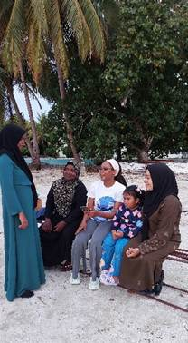
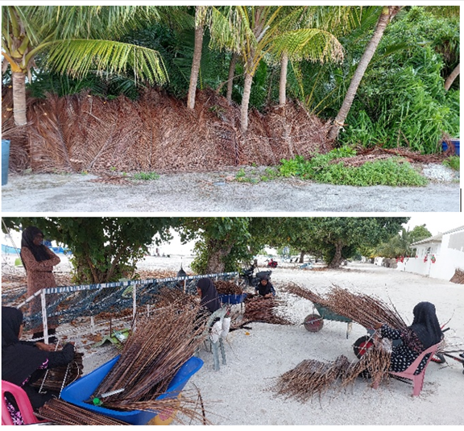

::: WordSection1
[Voices Across the Tide]{lang="EN-US"
style="font-size:20.0pt;line-height:
115%;color:#005198"}

[By Gillian Babb  ]{lang="EN-US"}

When I arrived in Mulah and Kolhufushi, I was welcomed into communities
shaped by water, roots, and the rhythm of daily life.

On the island of Mulah, I met women who know a lot about *Kan'doo faa*
(mangroves). In the Maldives, all women older than 30 are called
"*Dhatth*a". The equivalent in Suriname is "*Tante*", which signifies a
form of [respect for women in both cultures.]{lang="EN-US"}[
]{lang="EN-US"}I gained a lot of insight from three *Dhatthas* whose
knowledge of the mangroves is both practical and deeply woven into the
culture, and each revealing a different facet of the mangrove's place in
island life.

[{#Picture 5 width="208"
height="378"}]{lang="EN-US"}

[Surveying Dhatthas in Kolhufushi]{lang="EN-US"}

 

Faaiza, the first *Dhattha*, demonstrated how to navigate the dense
tangle of roots and mud of the inland mangrove area. Hawwa, the second
*Dhattha*, spoke of visiting the mangroves mostly when family came from
other islands or the capital. She taught me about *kashikeyo*, the screw
pine fruit that also grows in mangrove areas. Her stories painted the
area as a treasured retreat, a space for connection and memory. Aisthu,
the third *Dhattha*, spent more frequent hours in the mangroves,
gathering coconut palm leaves for weaving thatch roofs and collecting
screw pine fruits. Through her hands-on work, the mangroves became a
source of both livelihood and cultural continuity. Through their stories
and demonstrations, I could sense how deeply they valued the mangroves
and believed in preserving and making them accessible for everyone.

[{#Picture 11 width="202"
height="302"}]{lang="EN-US"}

[Maldivian coconut snack]{lang="EN-US"}

Across the atoll in Kolhufushi, the story is different. Mangroves are
farther from where the people live, and many people have never walked
among the roots. There, I experienced Maldivian *Raivaru* (short,
rhythmic poems) and traditional singing while conducting surveys at
evening gathering spots. *Dhatthas* recited *Raivaru* about [daily life,
nature, and love. Since my survey focused on mangroves and seagrass, the
*dhatthas* recited one that praised]{lang="EN-US"} lagoons, reefs, and
seagrass beds. Another poem spoke of mangroves and *jinni* (supernatural
beings) on an uninhabited island. These songs and poems revealed the
importance the community places on these ecosystems as part of their
cultural heritage.

{width="576" height="535"}

[Gathered coconut palm leaves for weaving thatch roofs]{lang="EN-US"}

 

[In these communities, the *Dhatthas* I met are more than elders. They
are keepers of ecological wisdom, stories, and practices passed down
through generations.]{lang="EN-US"}

Coming from Suriname, where tropical plants and trees are abundant and
many edible fruits are found, I was struck by how much of the coconut
tree is used here. From eating the roots of a sprouted coconut to
roofing with woven palm leaves and building boats with the timber, it
was a cultural shock, but also a good lesson in resourcefulness. T[his
makes sense as coconut trees grow almost everywhere on the islands,
including near or at the edges of mangrove areas. ]{lang="EN-US"}

By the end of my fieldwork, I realized that although the mangroves and
seagrass are not well-known as economic assets on these islands, they
are living symbols of memories, skills, and cultural identity preserved
in *Raivaru* and the daily lives of these *Dhatthas*, their family, and
friends.

[ ]{lang="EN-US"}

[{#Picture 2 width="402"
height="302"}]{lang="EN-US"}

[Family of Dhattha Hawwa enjoying the Mangrove area     ]{lang="EN-US"}

[ ]{lang="EN-US"}

[{#Picture 1 width="356"
height="792"}]{lang="EN-US"}

[Gillian and Dhattha Aisthu]{lang="EN-US"}
:::
